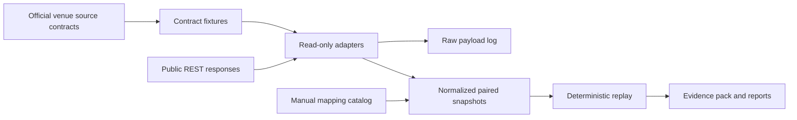

# Architecture

The supported architecture is a read-only research kernel plus a quarantined legacy
execution-capable bot.

## Data flow

## Supported runtime

- `research.transport.ReadOnlyTransport` restricts network access to allowlisted public
  HTTPS hosts and `GET`/`HEAD`.
- `research.contracts` validates consumed fields before data is aggregated or replayed.
- `research.mapping` loads only `status: approved` mappings.
- `research.event_log` writes append-only raw records and snapshots.
- `research.replay` evaluates paper routes from executable quotes, depth, fee metadata,
  and quality gates.

## Legacy runtime

`main.py`, `core/`, `data/`, and `strategies/` contain execution-capable code from the
older bot. They remain in the repository for tests and auditability but are not the
default public entrypoint and are not live-ready.

The research runtime must not import the legacy runtime. That boundary is enforced by
tests and by the software health report.
