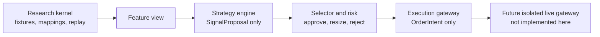

# Proposal-driven strategy platform

This document records the bounded production-platform direction from the external
technical report. It does not change the current live-trading status: live trading
remains `NO-GO`.

## Purpose

The repository now has two explicitly different layers:

1. `research/` remains the supported read-only Polymarket/Kalshi mapping, capture,
   contract-validation, and replay kernel.
2. `libs/` and `services/` define a future strategy platform where strategies produce
   auditable proposals, selector/risk decides whether those proposals are admissible,
   and an execution gateway can only emit order intents.

The important design choice is that a strategy never talks to a venue client and never
places an order. It emits a `SignalProposal`; every later step is separately audited.

## Stable contracts

The first implementation slice adds dependency-free dataclass contracts:

- `SignalProposal` — a strategy claim with edge, confidence, freshness, target
  relation/instrument, mode, and arbitrary audit payload.
- `RiskDecision` — an approval, resize, rejection, or shadow-only decision with reason
  codes.
- `OrderIntent` — a serializable non-transmitting plan. It is not a venue order and
  contains `payload.transmission = "disabled"` in the current gateway.
- `InstrumentRef` and `MarketRelation` — control-plane identifiers that keep mapping
  approval separate from title similarity or candidate discovery.

The selector/risk service defaults to paper-only approvals. Shadow proposals stop at
`SHADOW_ONLY`; canary or live behavior is not admitted by default.

## Database direction

The repository includes first-pass schema sketches:

- [PostgreSQL control plane](../sql/postgres/001_control_plane.sql) for instruments,
  relations, strategy configs, proposals, risk events, order intents, fills, positions,
  and LLM runs.
- [ClickHouse market-data store](../sql/clickhouse/001_market_data.sql) for append-only
  L2 books, trades, feature vectors, and PnL snapshots.

These schemas are design artifacts for a future service split. The current test and
research workflows do not require PostgreSQL, ClickHouse, Redis, queues, or any live
credential.

## Admitted strategy order

The report’s roadmap is intentionally conservative:

1. Cross-venue arbitrage and basket arbitrage, paper-only, using approved mappings and
   executable quote replay.
2. AI/news only as bounded structured extraction, not autonomous order generation.
3. Whale/order-book research only after provenance, replay, and evaluation contracts are
   reused.
4. Market making and reward farming remain disabled until their existing gates pass.

## Current boundary

This implementation does not add:

- live order placement;
- venue credential loading;
- authenticated WebSockets;
- hot credential reload;
- AI-generated orders;
- a production API server;
- a background queue or service orchestrator.

That is deliberate. The credible next step is to prove the data, mapping, and proposal
contracts before any transmitting executor exists.
